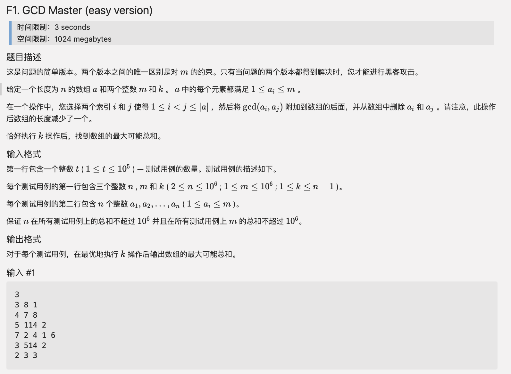

# codeforces translate

[Github](https://github.com/therehello/codeforces-translate)

[Blog](https://therehello.top/codeforces-translate)

## 安装

```bash
pip install codeforces-translate
```

## 基本功能

- [x] 翻译一个问题
- [x] 翻译一场比赛
- [ ] 输出为 $pdf$

## 快速使用

```bash
# cf-translate contest_id
# 翻译 Codeforces Round 859 (Div. 4)
# https://codeforces.com/contest/1807/problems
cf-translate 1807
# 翻译 The 2022 ICPC Asia Xian Regional Contest
# https://codeforces.com/gym/104077/problems
cf-translate 104077

# cf-translate contest_id id
# 翻译 Codeforces Round 859 (Div. 4) 的 A 题
# https://codeforces.com/contest/1807/A
cf-translate 1807 A
# 翻译 The 2022 ICPC Asia Xian Regional Contest 的 A 题
cf-translate 104077 A
```

以上命令会在当前路径下生成翻译后的 $markdown$ 文档，然后在支持 $markdown$ 的程序里预览

### 效果



## 注意

翻译一场比赛时，暂不支持无 problems 的比赛，你可以选择单独翻译一道问题

翻译采用谷歌翻译，请确保你能正常访问谷歌翻译

有时 codeforces 会挂掉，此程序会查询 5 分钟
